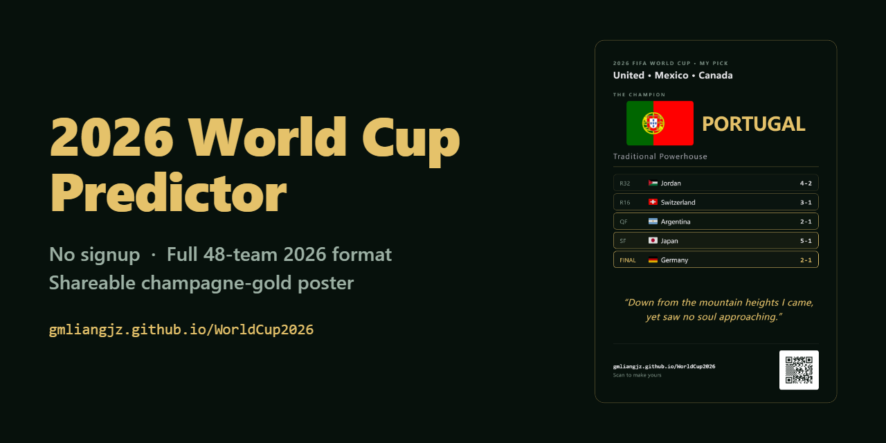
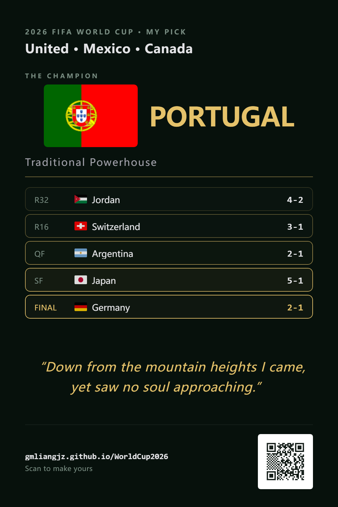
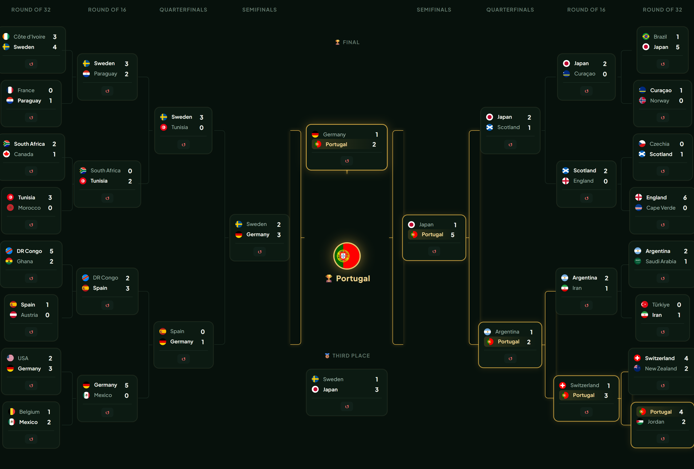
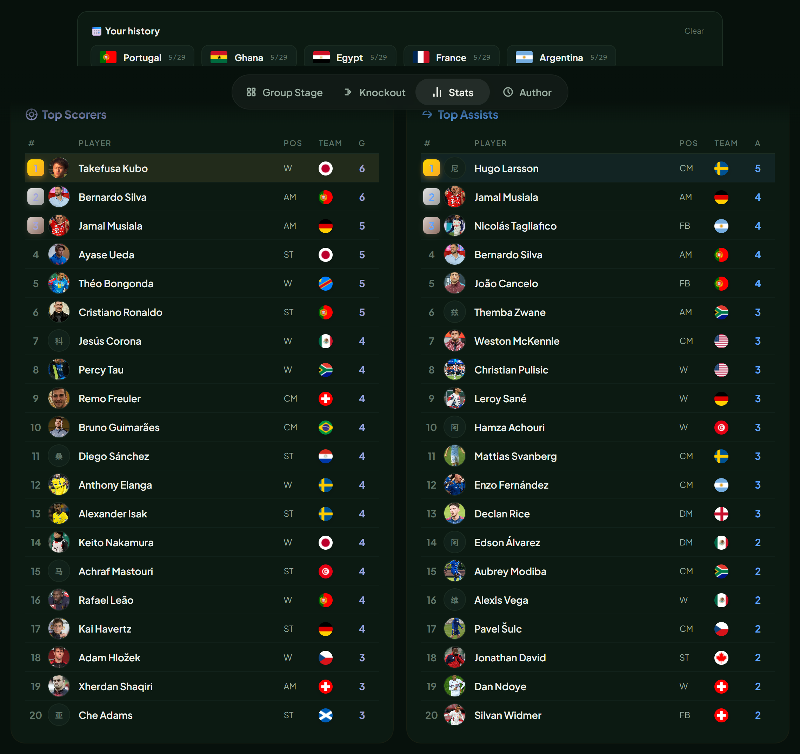

<p align="center">
  
</p>

<h1 align="center">2026 World Cup Predictor</h1>
<p align="center">
  <em>Self-hostable · MySQL-backed persistence · cross-device prediction sync</em><br>
  <em>可自部署 · MySQL 数据持久化 · 跨设备预测同步</em>
</p>

<p align="center">
  <b>48 teams</b> · <b>Stadium Scoreboard design</b> · <b>QR code prediction sharing</b> · <b>Docker Compose</b>
</p>

<p align="center">
  <a href="https://gmliangjz.github.io/WorldCup2026-Predictor/"></a>
  <a href="LICENSE"></a>
  
  
  
</p>

<p align="center"><sub>⚠️ Unofficial fan-made project · not affiliated with FIFA or the FIFA World Cup™ · 非官方粉丝作品，与 FIFA 无关</sub></p>

<p align="center">
  
</p>

<p align="center">
  
</p>

<p align="center">
  
</p>

<p align="center">
  
</p>

---

## English

A self-hostable simulator for the 2026 FIFA World Cup. Predict from the group stage to the final, watch the champion reveal with confetti, generate a shareable poster with a live QR code, and **persist your predictions in MySQL** so they follow you across devices.

**Just open `index.html` — or spin up the full stack with `docker compose up`.**

### ✨ Features

- **All 48 teams under the FIFA 2026 format**: 12 groups × 4 + 8 best-third advancement, with the new H2H-first tie-breaker
- **528 real players**: 48 teams × 11, classified into 8 positions (ST / W / AM / CM / DM / FB / CB / GK)
- **Strength-tier engine + upset cap**: 5 strength tiers with auto-weighted scoring; prevents unrealistic blowouts
- **Position-weighted goals**: strikers score, attacking mids assist — matches real on-pitch roles
- **Manual / semi-auto / full random**: type every score, click to randomize one match, or randomize everything at once
- **Top scorers + assists**: auto-tallied from your predictions, top 20 with Wikipedia headshots
- **Champion path reveal**: after the final, R32 → Final lights up progressively in gold + a confetti burst
- **Champagne-gold share poster**: 1080×1620 PNG, deep-forest-green base + champagne gold, with a 5-tier original tagline
- **Real QR code on every poster**: encodes a `?load=<prediction-id>` URL — scan to see the prediction on another device
- **MySQL-backed persistence**: predictions sync to your own MySQL 8.0 database; open on your phone, pick up where you left off on desktop
- **localStorage + server dual fallback**: works fully offline when the backend is unreachable
- **Stadium Scoreboard design**: dark pitch-black default with Orbitron LED-display typography, stadium-red score inputs, and optional daytime mode
- **Bilingual i18n**: one-tap toggle covering UI, team names, player names, and taglines
- **Light / dark theme**: dark-scoreboard by default; tap for light newspaper-style stadium mode
- **Prediction history**: last 5 predictions saved locally
- **Live scoring vs real results**: pulls real scores from ESPN's public JSON feed and grades your bracket in real time
- **Responsive**: mobile / 1080p / desktop breakpoints

### 🚀 Quick Start

Pick the path that fits you:

| You want… | Choose |
|---|---|
| Just try it, nothing to install | [Option 1](#option-1--static-file-zero-dependencies) |
| Full backend for real, easiest way | [Option 2](#option-2--docker-compose-recommended) |
| Full backend without Docker | [Option 3](#option-3--manual-without-docker) |

---

#### Option 1 — Static File (Zero Dependencies)

No server, no database — just open a file. Predictions stay in your browser's localStorage.

1. **Download the project**

   If you have git:
   ```bash
   git clone https://github.com/FrRay/WorldCup2026-Predictor.git
   cd WorldCup2026-Predictor
   ```

   Or without git: click the green **Code** button on the repo page → **Download ZIP** → unzip anywhere.

2. **Open `index.html`** — double-click it in your file explorer.

That's it. You can also serve it through any static server (Python, nginx, VS Code Live Server, etc.) — the app is a single HTML file.

> ⚠️ With this option, predictions only live in **one browser**. Clear your browser data and they're gone.

---

#### Option 2 — Docker Compose (Recommended)

This gives you the full backend: predictions saved in MySQL, shareable across devices via a prediction ID, QR codes that actually work. You need **Docker Desktop** or **Docker Engine** installed first ([download here](https://docs.docker.com/get-docker/)).

1. **Get the code**

   ```bash
   git clone https://github.com/FrRay/WorldCup2026-Predictor.git
   cd WorldCup2026-Predictor
   ```

   (No git? Click **Code → Download ZIP** on the repo page, unzip, open a terminal in that folder.)

2. **One command**

   ```bash
   docker compose up -d
   ```

   Docker will pull MySQL and Node.js images, create the database, and start everything. Wait about 30 seconds on first run (MySQL needs time to initialize).

3. **Open your browser** to `http://localhost:3000`

   You should see the predictor with a **green dot** in the top-right corner — that means the backend is connected.

4. **Make a prediction**, then check that it was saved:

   ```bash
   docker compose exec db mysql -u wc26 -pwc26pass wc26_predictor \
     -e "SELECT id, champion, updated_at FROM predictions;"
   ```

5. **To stop**: `docker compose down`. Data survives in the `mysql_data` volume — `docker compose up -d` brings everything back.

> 💡 **Deploying to a cloud server?**
> Upload the project to your server, run `docker compose up -d`, and set the `PORT` environment variable to match your reverse proxy (e.g. `PORT=8848 docker compose up -d`). If you're behind an HTTP proxy like Nginx or a cloud tunnel, point it to the port Node is listening on (default: 3000).

---

#### Option 3 — Manual (Without Docker)

You already have Node.js (v18+) and MySQL 8.0 running. This is the path for servers or developers.

**Prerequisites**: Node.js ≥18, MySQL 8.0 running with a database ready.

1. **Get the code** (clone or download ZIP)

   ```bash
   git clone https://github.com/FrRay/WorldCup2026-Predictor.git
   cd WorldCup2026-Predictor/server
   ```

2. **Install dependencies**

   ```bash
   npm install
   ```

3. **Create the database and table**

   ```bash
   # Log into MySQL as root and set up a user + database
   mysql -u root -p -e "
     CREATE DATABASE IF NOT EXISTS wc26_predictor CHARACTER SET utf8mb4;
     CREATE USER IF NOT EXISTS 'wc26'@'localhost' IDENTIFIED BY 'wc26pass';
     GRANT ALL PRIVILEGES ON wc26_predictor.* TO 'wc26'@'localhost';
     FLUSH PRIVILEGES;
   "

   # Run the schema
   mysql -u wc26 -pwc26pass wc26_predictor < init.sql
   ```

4. **Configure environment variables**

   | Variable | Default | What it is |
   |---|---|---|
   | `DB_HOST` | `localhost` | MySQL host |
   | `DB_PORT` | `3306` | MySQL port |
   | `DB_USER` | `wc26` | MySQL user |
   | `DB_PASSWORD` | `wc26pass` | MySQL password |
   | `DB_NAME` | `wc26_predictor` | Database name |
   | `PORT` | `3000` | Port the server listens on |

   Change any that differ from the defaults. On Linux/macOS:

   ```bash
   export DB_HOST=localhost DB_USER=wc26 DB_PASSWORD=wc26pass DB_NAME=wc26_predictor PORT=3000
   ```

   On Windows PowerShell:

   ```powershell
   $env:DB_HOST="localhost"; $env:DB_USER="wc26"; $env:DB_PASSWORD="wc26pass"; $env:DB_NAME="wc26_predictor"; $env:PORT="3000"
   ```

5. **Start the server**

   ```bash
   node server.js
   ```

   You should see: `World Cup Predictor server on http://localhost:3000`

6. **Open** `http://localhost:3000` — green dot = connected.

7. **Make it survive reboots** (Linux/systemd)

   See the [`server/wc26-predictor.service`](server/) example. Copy it to `/etc/systemd/system/`, edit the paths and env vars for your machine, then `systemctl enable --now wc26-predictor`.

### 🛠 Tech Stack

| Layer | Tool |
|---|---|
| Frontend | HTML / CSS / Vanilla JS (single `index.html`) |
| Backend | Node.js + Express (~120 lines, 3 API endpoints) |
| Database | MySQL 8.0 (JSON columns store predictions as-is) |
| Font | [Orbitron](https://fonts.google.com/specimen/Orbitron) (LED scoreboard display face) |
| Poster render | [html2canvas](https://html2canvas.hertzen.com/) 1.4.1 |
| QR code | [qrcodejs](https://github.com/davidshimjs/qrcodejs) |
| Celebration | [canvas-confetti](https://github.com/catdad/canvas-confetti) |
| Player photos | Wikipedia REST API |
| Flags | [FlagCDN](https://flagcdn.com/) |
| Orchestration | Docker Compose (MySQL + Node) |

### 📐 Algorithm

**Strength tiers** (`STRENGTH`, 1–5):
```
Tier 5: France / Spain / Argentina / England / Portugal / Brazil / Germany
Tier 4: Netherlands / Belgium / Croatia / Morocco / Uruguay / Colombia / Japan
Tier 3: USA / Mexico / Canada / Switzerland / Korea / Sweden / Türkiye … (20 teams)
Tier 2: Saudi Arabia / Qatar / Egypt / Bosnia / Panama … (11 teams)
Tier 1: Haiti / Curaçao / Cape Verde
```

**Score sampling** (`rnd`):
- Base probability table `WW = [0,0,0,0,1,1,1,1,1,1,2,2,2,2,3,3,4,5]` (mostly 0–2 goals, occasionally 3–5)
- Strength-delta weighting: `boostP = |Δ| × 0.20`, `nerfP = |Δ| × 0.12`
- Knockout forces a decisive result; the group stage allows draws

**Upset cap** (`applyUpsetCap`, knockout only):
- When a weak team (≥ 2-tier gap) wins, the scoreline is rewritten to 1-0 / 2-0 / 2-1
- Keeps the upset alive while avoiding unrealistic blowouts

**Group ranking** (`rankGroup`) under the 2026 FIFA rules:
1. Points → 2. **H2H points** (changed from 2022!) → 3. H2H goal difference → 4. H2H goals → 5. overall GD → 6. overall goals

> ⚠️ FIFA reordered the 2026 tie-breakers, moving head-to-head ahead of overall goal difference — the key change from 2022.

### 📊 Scoring (live during the tournament)

Real results stream in from ESPN's public feed and your bracket is scored against reality as the cup unfolds:

| Correct call | Points |
|---|---|
| Group result (W/D/L direction) | 3 |
| Exact group scoreline (bonus) | +2 |
| Team correctly reaching R16 | 5 / team |
| Team correctly reaching QF | 8 / team |
| Team correctly reaching SF | 12 / team |
| Team correctly reaching Final | 16 / team |
| Correct 3rd place | 15 |
| Correct runner-up | 20 |
| **Correct champion** | **30** |

### 📝 Champion Taglines (Original Tribute)

Each champion tier triggers an original Chinese commentary-style tagline, with a parallel English version. **These are original tributes to the Chinese sports-broadcasting tradition — not quotations from any specific commentator.**

| Tier | Champions | English | 中文 |
|---|---|---|---|
| **Traditional Powerhouse** | FR / ES / AR / EN / PT / BR / DE | *Down from the mountain heights I came, yet saw no soul approaching.* | *我自山峰而下，犹未见来人。* |
| **Golden Generation** | NL / BE / HR / MA / UY / CO / JP | *For a generation that lived in the word 'almost' — 'almost' ends tonight.* | *「差一点」是这一代人最熟悉的三个字……* |
| **Dark Horse** | USA / Switzerland / Norway … | *The greatness of football lies precisely in its refusal to bow to any ranking…* | *足球的伟大之处，正是它不肯臣服于任何排行榜……* |
| **Underdog Legend** | SA / QA / EG / Bosnia / Panama … | *Ninety minutes silenced every prediction…* | *他们用九十分钟，让所有的预言安静下来……* |
| **Fairy Tale** | Haiti / Curaçao / Cape Verde | *Names that never appeared in any forecast…* | *这些从未出现在任何冠军预测里的名字……* |

### 🗺 Roadmap

- [x] Full 48-team FIFA 2026 format
- [x] 528-player roster + 8-position classification
- [x] Strength tiers + upset cap
- [x] Champagne-gold share poster (1080×1620)
- [x] 5 original champion taglines
- [x] Bilingual + light/dark themes
- [x] Shareable prediction URL (friends scan to see yours)
- [x] Prediction history (last 5)
- [x] Live result scoring via ESPN's public API
- [x] MySQL backend persistence (Node.js/Express + Docker Compose)
- [x] Real QR codes on share posters (qrcodejs)
- [x] Stadium Scoreboard visual redesign (Orbitron, dark default)
- [ ] Pre-tournament squad refresh (2026)
- [ ] PWA support (add to home screen)

### 🙏 Credits

- Flags: [FlagCDN](https://flagcdn.com/) (CC0)
- Player photos: Wikipedia REST API
- Poster rendering: [html2canvas](https://html2canvas.hertzen.com/) by [niklasvh](https://github.com/niklasvh)
- QR code: [qrcodejs](https://github.com/davidshimjs/qrcodejs) by [davidshimjs](https://github.com/davidshimjs)
- Celebration: [canvas-confetti](https://github.com/catdad/canvas-confetti) by [catdad](https://github.com/catdad)
- Player rosters: snapshot of 2024-2025 national-team squads (refreshed before 2026 kick-off)
- Commentary: **original tribute to Chinese sports broadcasting**, not any specific commentator's work

### 📄 License

MIT — see [LICENSE](LICENSE). Third-party assets (flags, photos, taglines): [NOTICE](NOTICE.md).

---

## 中文

一个可自行部署的 2026 FIFA 世界杯预测器。从小组赛模拟到决赛，看冠军路径逐轮点亮 + 五彩礼花，生成带真实二维码的分享海报，并**将你的预测保存到 MySQL**——换个设备打开，进度还在。

**直接打开 `index.html` 就能用，或者 `docker compose up` 一键部署全栈。**

### ✨ 功能特性

- **48 队完整 FIFA 2026 新赛制**：12 组 × 4 队 + 8 个三档晋级，按 FIFA 2026 官方的 H2H 优先 tie-breaker 规则
- **528 名球员真实花名册**：48 队 × 11 人，含 8 档位置分类（中锋 / 边锋 / 前腰 / 中前卫 / 后腰 / 边卫 / 中卫 / 门将）
- **强度档位 + 冷门上限算法**：5 档球队强度，强弱差额自动加权；防止"沙特 5-1 巴西"这种不真实大比分爆冷
- **位置加权进球分布**：中锋多进球、攻中多助攻——按真实足球场上分工
- **手动 / 半自动 / 全随机**：每场比分可以全手填、点几下随机、或者一键随机全部
- **射手榜 + 助攻榜**：自动统计你预测中的进球者，前 20 名带球员头像（Wikipedia API）
- **冠军路径动画**：决赛揭晓后，从 32 强到决赛逐轮金色高亮 + 五彩纸屑庆祝
- **香槟金分享海报**：1080×1620 PNG，深墨绿底 + 香槟金，五档对应五段原创解说词
- **海报内置真实二维码**：编码 `?load=<预测ID>` 链接——扫码即可在另一台设备查看你的预测
- **MySQL 数据持久化**：预测同步到你自己的 MySQL 8.0 数据库；手机上打开，桌面上的进度自动恢复
- **localStorage + 服务器双重保障**：后端不可用时自动降级到纯离线模式
- **球场记分牌视觉风格**：默认深黑球场底色 + Orbitron LED 数字字体 + 红色比分输入框 + 可选白底日间模式
- **中英双语 i18n**：右上角一键切换，UI / 球队名 / 球员名 / 文案全套双语
- **浅色 / 深色主题**：默认深色记分牌风格；点一下切换到白底报纸风球场模式
- **预测历史记录**：保存最近 5 次预测在本地
- **真实赛果实时计分**：开赛后自动拉取真实比分（ESPN 公开 JSON 接口，免 key），实时给你的预测打分
- **响应式适配**：移动端 / 1080p / 桌面三段断点

### 🚀 快速开始

根据你的情况选择一种方式：

| 你想… | 选哪个 |
|---|---|
| 先试试看，不想装任何东西 | [方式一](#方式一--纯静态文件零依赖) |
| 完整后端，最简单的方式 | [方式二](#方式二--docker-compose推荐) |
| 完整后端，不用 Docker | [方式三](#方式三--手动部署不用-docker) |

---

#### 方式一 — 纯静态文件（零依赖）

不需要服务器、不需要数据库——直接打开一个文件就能用。预测记录保存在浏览器的 localStorage 里。

1. **下载项目**

   有 git 的话：
   ```bash
   git clone https://github.com/FrRay/WorldCup2026-Predictor.git
   cd WorldCup2026-Predictor
   ```

   没有 git？在仓库页面点绿色的 **Code** 按钮 → **Download ZIP** → 解压到任意文件夹。

2. **双击打开 `index.html`**

   就这么简单。你也可以用任意静态服务器托管它（Python、nginx、VS Code Live Server 都可以），因为整个应用就是一个 HTML 文件。

> ⚠️ 这种方式下，预测只保存在**当前浏览器**里。清缓存或换浏览器就没了。

---

#### 方式二 — Docker Compose（推荐）

这种方式给你完整后端：预测存入 MySQL、可以跨设备同步、海报上的二维码是真的。前提：你的电脑上已经装了 **Docker Desktop** 或 **Docker Engine**（[点这里下载](https://docs.docker.com/get-docker/)）。

1. **获取代码**

   ```bash
   git clone https://github.com/FrRay/WorldCup2026-Predictor.git
   cd WorldCup2026-Predictor
   ```

   （没有 git？仓库页点 **Code → Download ZIP**，解压后在那个文件夹里打开终端。）

2. **一条命令启动**

   ```bash
   docker compose up -d
   ```

   Docker 会自动拉取 MySQL 和 Node.js 镜像、创建数据库表、启动服务。首次运行等一下（MySQL 初始化大约 30 秒）。

3. **打开浏览器**访问 `http://localhost:3000`

   右上角应该出现一个**绿色小圆点**——说明后端已连接。

4. **随便预测几场**，然后验证数据已经写入数据库：

   ```bash
   docker compose exec db mysql -u wc26 -pwc26pass wc26_predictor \
     -e "SELECT id, champion, updated_at FROM predictions;"
   ```

5. **停止服务**：`docker compose down`。数据保存在 `mysql_data` 卷里不会丢，再跑 `docker compose up -d` 就全部恢复。

> 💡 **部署到云服务器？**
> 把项目上传到服务器，跑 `docker compose up -d`，然后在启动命令前设置 `PORT` 环境变量来匹配你的反向代理端口（例如 `PORT=8848 docker compose up -d`）。如果你在 Nginx 或云隧道后面，把域名指向 Node 监听的端口（默认 3000）即可。

---

#### 方式三 — 手动部署（不用 Docker）

你已经有一台装了 Node.js（≥18）和 MySQL 8.0 的机器。适合在服务器上部署或开发者自己折腾。

**前提**：Node.js ≥18 已安装，MySQL 8.0 已启动。

1. **获取代码**（clone 或下载 ZIP）

   ```bash
   git clone https://github.com/FrRay/WorldCup2026-Predictor.git
   cd WorldCup2026-Predictor/server
   ```

2. **安装依赖**

   ```bash
   npm install
   ```

3. **创建数据库和表**

   ```bash
   # 用 root 登录 MySQL，创建用户和数据库
   mysql -u root -p -e "
     CREATE DATABASE IF NOT EXISTS wc26_predictor CHARACTER SET utf8mb4;
     CREATE USER IF NOT EXISTS 'wc26'@'localhost' IDENTIFIED BY 'wc26pass';
     GRANT ALL PRIVILEGES ON wc26_predictor.* TO 'wc26'@'localhost';
     FLUSH PRIVILEGES;
   "

   # 建表
   mysql -u wc26 -pwc26pass wc26_predictor < init.sql
   ```

4. **配置环境变量**

   | 变量 | 默认值 | 说明 |
   |---|---|---|
   | `DB_HOST` | `localhost` | MySQL 主机地址 |
   | `DB_PORT` | `3306` | MySQL 端口 |
   | `DB_USER` | `wc26` | MySQL 用户名 |
   | `DB_PASSWORD` | `wc26pass` | MySQL 密码 |
   | `DB_NAME` | `wc26_predictor` | 数据库名 |
   | `PORT` | `3000` | 服务器监听端口 |

   把跟你实际环境不一样的值设好。Linux/macOS：

   ```bash
   export DB_HOST=localhost DB_USER=wc26 DB_PASSWORD=wc26pass DB_NAME=wc26_predictor PORT=3000
   ```

   Windows PowerShell：

   ```powershell
   $env:DB_HOST="localhost"; $env:DB_USER="wc26"; $env:DB_PASSWORD="wc26pass"; $env:DB_NAME="wc26_predictor"; $env:PORT="3000"
   ```

5. **启动服务**

   ```bash
   node server.js
   ```

   看到 `World Cup Predictor server on http://localhost:3000` 就说明跑起来了。

6. **打开** `http://localhost:3000`——右上角绿色圆点 = 已连接。

7. **让它在重启后自动启动**（Linux/systemd）

   参见仓库里 [`server/wc26-predictor.service`](server/) 的示例文件。拷贝到 `/etc/systemd/system/`，改好路径和环境变量，然后 `systemctl enable --now wc26-predictor` 即可。

打开 `http://localhost:3000`。右上角出现**绿色小圆点**即表示后端已连接。

### 🛠 技术栈

| 类别 | 工具 |
|---|---|
| 前端 | HTML / CSS / Vanilla JS（单文件 `index.html`） |
| 后端 | Node.js + Express（~120 行，3 个 API 接口） |
| 数据库 | MySQL 8.0（JSON 列直接存储预测数据） |
| 字体 | [Orbitron](https://fonts.google.com/specimen/Orbitron)（球场记分牌 LED 风格） |
| 海报渲染 | [html2canvas](https://html2canvas.hertzen.com/) 1.4.1 |
| 二维码 | [qrcodejs](https://github.com/davidshimjs/qrcodejs) |
| 庆祝效果 | [canvas-confetti](https://github.com/catdad/canvas-confetti) |
| 球员头像 | Wikipedia REST API |
| 国旗资源 | [FlagCDN](https://flagcdn.com/) |
| 容器编排 | Docker Compose（MySQL + Node 双容器） |

### 📐 算法说明

（与英文部分相同）

### 📊 计分机制（赛中实时）

预测不只是娱乐——真实比分从 ESPN 公开接口实时流入，你的预测随赛事推进自动对照打分：

| 命中项 | 得分 |
|---|---|
| 小组赛胜 / 平 / 负方向正确 | 3 |
| 小组赛比分完全正确（额外加成） | +2 |
| 正确把球队送进 16 强 | 5 / 队 |
| 正确把球队送进 8 强 | 8 / 队 |
| 正确把球队送进 4 强 | 12 / 队 |
| 正确把球队送进决赛 | 16 / 队 |
| 季军命中 | 15 |
| 亚军命中 | 20 |
| **冠军命中** | **30** |

### 📝 五档冠军解说词（原创致敬）

每档冠军对应一段原创结束语，致敬中国体育解说的诗化传统。**这些是原创仿写，不是任何具体解说员作品的引用。**

（参见上方 English 部分的表格）

### 🗺 路线图

- [x] 完整 48 队 FIFA 2026 赛制
- [x] 528 球员花名册 + 8 档位置分类
- [x] 强度档位 + 冷门上限算法
- [x] 香槟金分享海报（1080×1620）
- [x] 5 档原创冠军解说词
- [x] 中英双语 + 浅/深主题
- [x] 分享 URL 携带预测 state
- [x] 历史预测记录（最近 5 次）
- [x] 接入真实赛果实时计分（ESPN 公开接口）
- [x] MySQL 后端持久化（Node.js/Express + Docker Compose）
- [x] 分享海报真实二维码（qrcodejs）
- [x] 球场记分牌视觉重设计（Orbitron 字体，深色默认）
- [ ] 2026 临开赛球员名单更新
- [ ] PWA 支持（加到主屏幕）

### 📄 License

MIT — 详见 [LICENSE](LICENSE)。第三方素材（旗帜 / 头像 / 解说词）声明见 [NOTICE](NOTICE.md)。

---

<p align="center">⚽ Made for football fans, written with care. Designed to run on your own server.</p>
